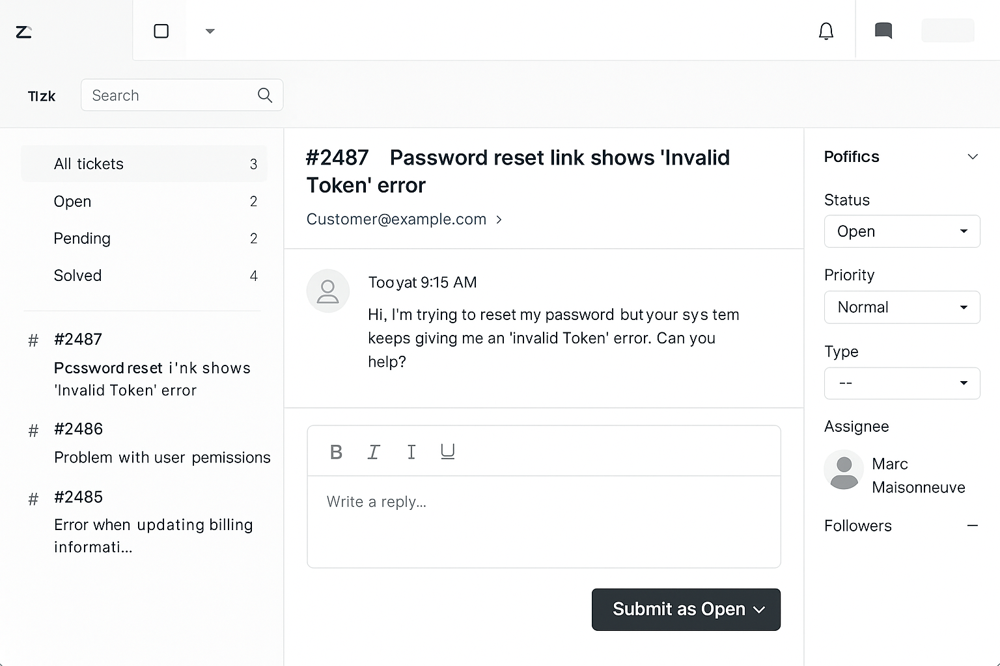

🇬🇧 [English version available here](./README.md)

# 🧪 Simulation de Ticket SaaS – Scénario de Support Zendesk

Ce projet simule un ticket de support SaaS réaliste, géré dans un outil comme Zendesk. Il inclut :

- Une **demande client** simulée
- Une **note interne** décrivant ma démarche de résolution
- Une **réponse au client** professionnelle
- Bonus : structure de dossiers et capture d’écran d’interface

---

## 🎯 Scénario : Échec de réinitialisation du mot de passe – « Jeton invalide »

**Message du client (via Zendesk) :**  
> « Bonjour, j’essaie de réinitialiser mon mot de passe, mais votre système affiche une erreur ‘Jeton invalide’. Pouvez-vous m’aider ? »

---

## 🧠 Notes internes (réservées à l’équipe)

**Étapes que je suivrais avant de répondre au client :**

1. ✅ Rechercher l’adresse courriel du client dans notre base de données  
2. 🔍 Vérifier si le jeton de réinitialisation est expiré (souvent valide 15 à 60 minutes)  
3. 🔁 Si expiré, générer un nouveau lien de réinitialisation manuellement  
4. 🛠 Signaler le bug à l’équipe de développement si le problème est récurrent  
5. 📝 Documenter chaque étape en interne

Voir dossier : `internal_notes/zendesk_internal_note_01.md`

---

## 💬 Réponse client

**Ton :** Calme, empathique et professionnel  
**Objectif :** Rassurer le client et résoudre le problème clairement

Voir dossier : `customer_responses/zendesk_customer_reply_01.md`

---

## 📁 Structure du projet

saas-ticket-simulation/  
│  
├── internal_notes/  
│   └── zendesk_internal_note_01.md  
├── customer_responses/  
│   └── zendesk_customer_reply_01.md  
├── screenshots/  
│   └── zendesk_ui_mockup.png (optionnel)  
└── README.fr.md

---

## 🖼 Aperçu de l’interface Zendesk

---

## 🛠 Technologies simulées

- 📨 Zendesk (outil de gestion de tickets)
- 🗂 Documentation interne (type Notion)
- 🧠 Compétences humaines : écoute active, clarté, empathie, logique structurée

---

## 🔄 Leçon tirée / Réflexion

- Simuler un environnement de support aide à bâtir la confiance en soi face à des situations réelles  
- Des notes internes claires évitent les malentendus lors du relais entre membres d’équipe  
- Les clients ne veulent pas seulement une solution — ils veulent être écoutés et guidés avec soin

---

## 🇫🇷 Version anglaise disponible ici :  
👉 [README.md](./README.md)
