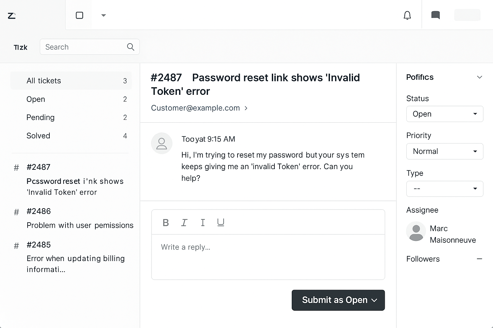

🇫🇷 [Version française disponible ici](./README.fr.md)

# 🧪 SaaS Ticket Simulation – Zendesk-style Support Scenario

This project simulates a real-life SaaS support ticket handled through a tool like Zendesk. It includes:

- A sample **customer support request**
- An **internal note** showing how I’d think through and resolve the issue
- A sample **customer-facing response**
- Bonus: folder structure and example screenshots

---

## 🎯 Scenario: Password Reset Fails with "Invalid Token"

**Customer's Message (via Zendesk):**
> “Hi, I’m trying to reset my password but your system keeps giving me an ‘Invalid Token’ error. Can you help?”

---

## 🧠 Internal Notes (for team only)

**Steps I would take before replying to the customer:**

1. ✅ Search customer email in our database
2. 🔍 Check if token is expired (they often expire within 15–60 mins)
3. 🔁 If expired, manually trigger a new password reset link
4. 🛠 Log error to dev team if it appears to be a recurring issue
5. 📝 Document everything internally

See folder: `internal_notes/zendesk_internal_note_01.md`

---

## 💬 Customer-Facing Reply

**Tone:** Calm, supportive, and professional  
**Goal:** Reassure the customer and resolve the issue clearly

See folder: `customer_responses/zendesk_customer_reply_01.md`

---

## 📁 Folder Structure

saas-ticket-simulation/
│
├── internal_notes/
│ └── zendesk_internal_note_01.md
├── customer_responses/
│ └── zendesk_customer_reply_01.md
├── screenshots/
│ └── zendesk_ui_mockup.png (optional)
└── README.md
### 🖼 Sample Zendesk Ticket View

---

## 🛠 Tech Stack + Tools Simulated

- 📨 Zendesk (ticketing)  
- 🗂 Internal documentation (Notion-style notes)  
- 🧠 Soft Skills: Calm under pressure, clear writing, empathy, step-by-step thinking  

---

## 🧠 Bonus Experience

Before transitioning into SaaS support, I completed training at **Virgin Mobile** in a traditional phone-based tech support environment.

- Handled real customer calls under live pressure  
- Took internal notes manually (no AI assist)  
- Practiced calm, clear communication with frustrated customers  
- Was praised by supervisors for empathy and listening skills

This early exposure gave me a deep respect for service — today, I combine that real-world foundation with modern tools like Zendesk, ChatGPT, and bilingual workflows to deliver thoughtful, efficient support in any environment.

---

## 🔄 Lessons Learned / Reflection

- Simulating customer support helps build confidence under real-world pressure  
- Writing clear internal notes avoids confusion in team handoffs  
- Customers don’t just want fixes — they want clarity and care  

---

